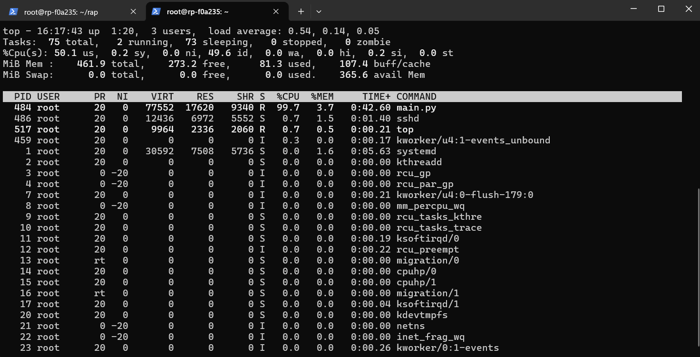

# RF Signal Recording and Playback script

RF Signal Record and Playback script records signal pulses acquired on either IN1 and IN2 and repeats them on OUT1 acording to the configuration file.
Deep Memory Acquisition and Generation are used to record and playback the captured signals.

This application is not meant to be used in parallel with the Red Pitaya WEB interface. As most processing resources is taken by the *Record and Play* application, the Web interface is severly slowed down. 

## Setup

The application requires the following OS version:
- Nightly Build 426 (or higher) together with Red Pitaya Linux 2.06 (or higher).

Please make sure that Red Pitaya inputs and outputs are properly terminated (matched impedance). Failure to do so may lead to undefined behaviour of the *Record and Playback* application due to the [ringing](https://incompliancemag.com/circuit-theory-model-of-ringing-on-a-transmission-line/) on the [transmission line](https://en.wikipedia.org/wiki/Transmission_line).
Red Pitaya fast analog inputs have input impedance of 1 MΩ. The fast analog outputs have output impedace of 50 Ω.

**Installation  steps:**

1. Establish SSH connection with your Red Pitaya
2. Download the "rec_and_play" GitHub Repository to the Red Pitaya.
   ```
   cd /root
   git clone https://github.com/RedPitaya/rec_and_play.git rap
   ```
   Alternatively, download the repository to your computer and copy the code to the Red Pitaya through the SCP command:
   ```
   scp -r /<path-to-downloaded-repository>/rec_and_play root@rp-xxxxxx.local:/root
   ```
3. Move to the *Record and Play* directory on the Red Pitaya.
   ```cd /root/rap```
4. Make sure all the scripts are executable (use the `chmod` commnad).
   ```chmod +x setup.sh config.ini main.py```
5. To autorun the application at boot, execute the following script:
   ```./setup.sh```
6. For manual installation enter read-write mode in Red Pitaya and copy the scripts into the "/opt/redpitaya/bin" folder.
   ```
   rw
   cp -f ./main.py /opt/redpitaya/bin/
   cp -f ./config.ini /opt/redpitaya/bin/
   ```
7. The configuration file is located in "/opt/redpitaya/bin/config.ini".
8. Reboot the Red Pitaya.

## Configuration

The *Record and Play* application settings are specified in the configuration file (config.ini) located in "/opt/redpitaya/bin/" directory.
The settings are split into acquisition (ADC) and generation (DAC):

**Acquisition (ADC)**

- Trigger level (in Volts)
- Trigger source (CH1_PE, CH1_NE, CH2_PE, CH2_NE)
- Record buffer lenght (uses Deep Memory Acquisition) in microseconds (between 1 and 30 µs)

**Generation (DAC)**

- Signal generation source channel (IN1 or IN2) - which input channel should be generated/repeated on OUT1
- Number of Cycles (NCYC) - Number of Cycles/Periods in one burst/repetition (without any delay between them)
- Number of Repetitions (NOR) - Number of repeated bursts (with delay between them). Each burst includes a number of repetitions without delay.
- Delay between repetitions (PERIOD) - Delay between repetitions in microseconds (µs).

Example of "config.ini":
```
[ADC]
; Level in volts
trigger_level = 0.1
; Values: CH1_PE, CH1_NE, CH2_PE, CH2_NE
trigger_mode = CH1_PE
; Buffer size in microseconds
buffer_time = 20

[DAC]
; Gen signal from source: IN1,IN2
signal_source=IN1
; Number of signal repetitions without delays
count_burst=1
; Number of repetitions with delay. Includes the number of repetitions without delay.
repetition=3
; Delay between repetitions.
repetition_delay=10
```

## Disable the Record and Play

Once the *Record and Play* application is set up, it will start each time Red Pitaya boots. Here is how you can disable the process.

- **One time disable** - to stop the application until the next boot use the `top` command inside Red Pitaya Linux and `kill` the *main.py* process. By entering the PID of the process, the Linux will kill it.
  
- **Full disable** - First kill the *main.py* process as described in the point above. Then head to the "/opt/redpitaya/sbin" directory and find the **startup.sh** script (you may have to enter *rw* mode). Either delete or comment the following lines of code:
  ```
  # Here you can specify commands for autorun at system startup
  export PYTHONPATH=/opt/redpitaya/lib/python/:$PYTHONPATH
  /opt/redpitaya/bin/main.py
  ```
  You can also remove the *main.py* and *config.ini* from */opt/redpitaya/bin*.


